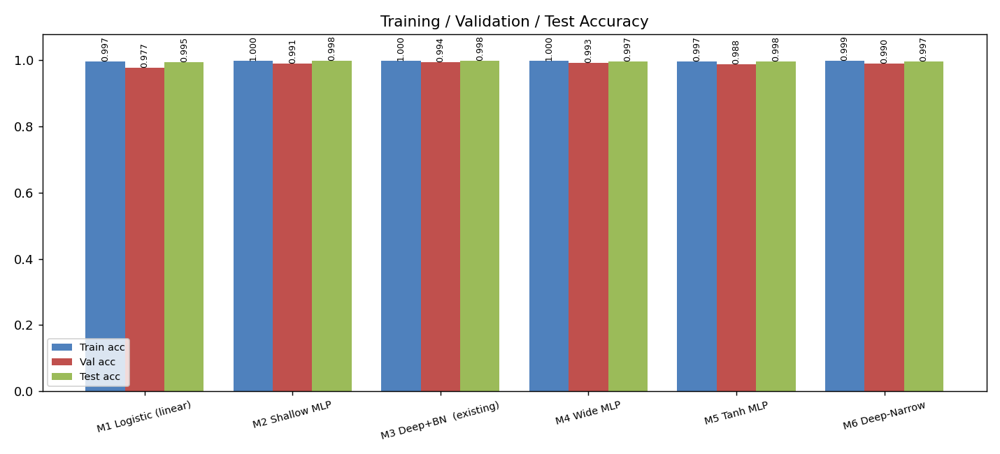
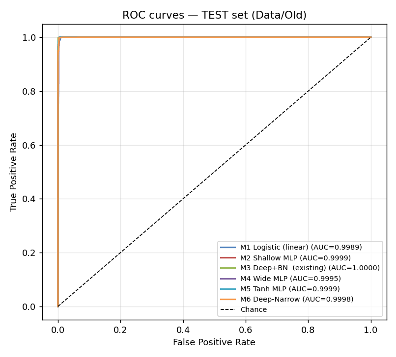
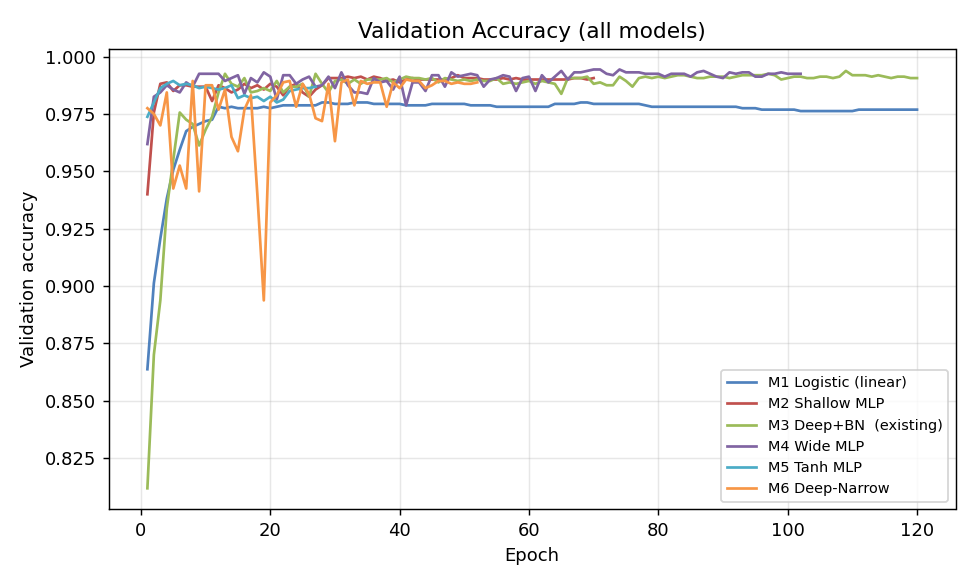
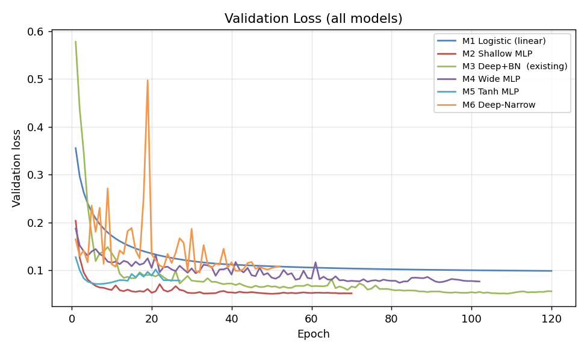

# CoMoFoD — Copy-Move Forgery Detection: Model Testing, Optimisation & Comparison


This repository contains the execution code, results and description for testing
and optimising a copy-move forgery-detection model on the CoMoFoD-style dataset,
together with a six-model comparison study.

The detector is built on a **frozen triplet Siamese network** (`copy_move`,
checkpoint `ckpt-5004`) that produces 128-d patch embeddings. The model is used
**only for inference** throughout — it is never retrained. All optimisation
happens in lightweight verifier/classifier heads on top of the frozen embeddings.

## Repository layout

```
comparison/                 Six-model comparison (the headline study)
  code/                     execution scripts (compare_models.py + pipeline)
  result/                   all CSVs + PNGs (bar/line graphs, confusion, ROC)
  model/                    all 6 trained verifier checkpoints + best_model.keras
  README.md                 full protocol + results table
results_verification/       Verification-task evaluation (genuine vs impostor)
results_localization/       Per-block forgery-localisation evaluation
scripts/                    All execution scripts used across the project
```

## Headline results

### 1. Verification task (the task the triplet model was trained for)
Train on `Data/New`, validate on a held-out split, test on `Data/Old`.

| | Baseline (raw distance) | Optimised (MLP verifier) |
|---|:--:|:--:|
| Accuracy | 0.725 | **0.994** |
| Held-out (test) accuracy | 0.744 | **0.998** |
| F1 / ROC-AUC | 0.757 / 0.768 | **0.994 / 0.9995** |

### 2. Six-model comparison (test = `Data/Old`)
| Model | Test acc | F1 | FN | ROC-AUC |
|---|:--:|:--:|:--:|:--:|
| M1 Logistic | 0.9948 | 0.995 | 13 | 0.9989 |
| M2 Shallow MLP | 0.9982 | 0.998 | 3 | 0.9999 |
| **M3 Deep+BN (existing)** | **0.9982** | 0.998 | **2** | **1.0000** |
| M4 Wide MLP | 0.9971 | 0.997 | 2 | 0.9995 |
| M5 Tanh MLP | 0.9975 | 0.998 | 6 | 0.9999 |
| M6 Deep-Narrow | 0.9970 | 0.997 | 9 | 0.9998 |

🏆 **Best model: M3 Deep+BN (the existing model)** — highest test accuracy,
highest ROC-AUC and fewest false negatives. Saved as
`comparison/model/best_model.keras`. All six models exceed **99% test accuracy**.

#### Comparison figures
| Accuracy (train / val / test) | ROC curves (test set) |
|:--:|:--:|
|  |  |

| Validation accuracy vs epoch | Validation loss vs epoch |
|:--:|:--:|
|  |  |

### 3. Localisation task (per-block forged/authentic map)
A harder task where the frozen embedding carries only a weak signal; the
optimised classifier still beats the original detector on every metric
(F1 0.26→0.34, AUC 0.42→0.60, accuracy 0.16→0.45). See
`results_localization/README_RESULTS.md`.

## Environment
TensorFlow 2.20 in a short-path venv (`C:\tfv`) — the legacy TF1 meta-graph is
loaded under `tf.compat.v1`. See `comparison/README.md` for reproduction steps.

## Session log
A chronological log of the PowerShell commands and outputs (environment repair →
evaluation → comparison → commit) is in [`logs/execution_log.md`](logs/execution_log.md).

## Notes
* Large regenerable artefacts (`*.npz` embedding caches) and the original frozen
  TF checkpoint / dataset are intentionally **not** committed (size limits); the
  scripts regenerate the embedding caches from the dataset + frozen model.
